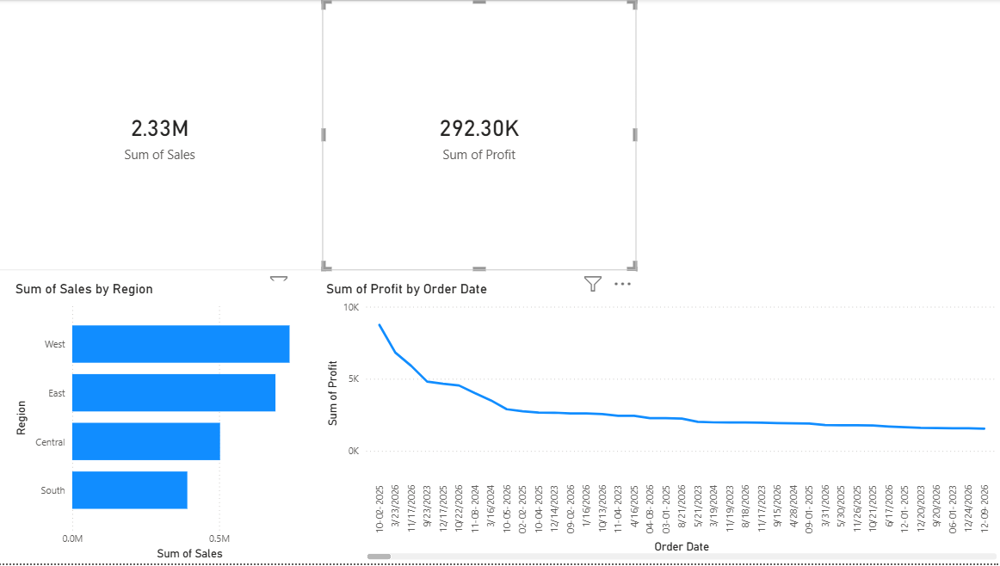
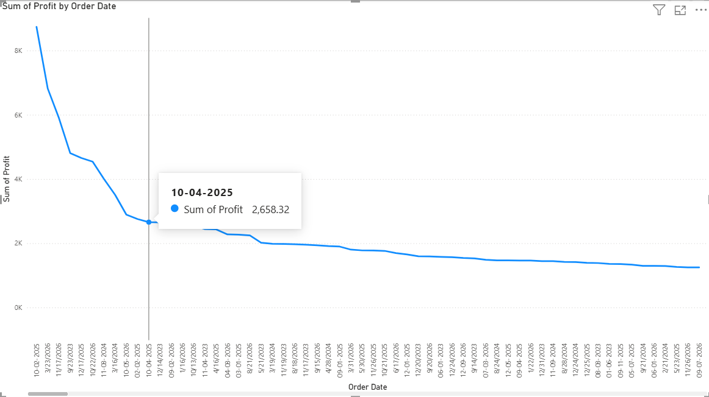
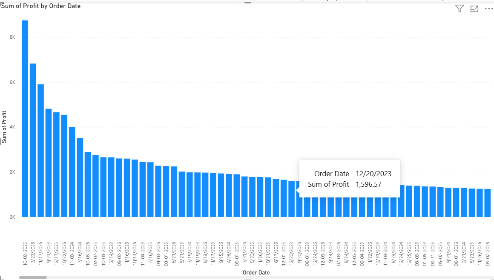
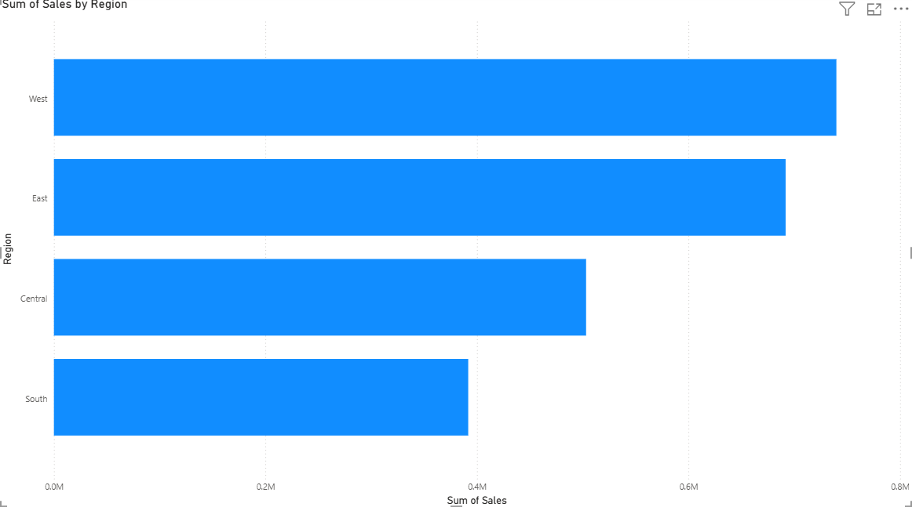

# 📊 Sales Data Analysis

## 📌 Project Overview
This project focuses on analyzing sales data to identify key business insights such as regional performance, product trends, and profitability. The analysis was performed using SQL, Excel, and Power BI to support data-driven decision making.

---

## 🛠️ Tools & Technologies Used
- SQL (Data querying and analysis)
- Microsoft Excel (Data cleaning and preprocessing)
- Power BI (Data visualization and dashboard creation)

---

## 📂 Project Structure
sales-data-analysis/
│
├── data/
│ └── sales_data_cleaned.xlsx
│
├── images/
│ ├── dashboard_overview.png
│ └── kpi_cards.png
│ ├── profit_trend.png
│ ├── profit_trend_bar.png
│ └── sales_by_region.png
│
├── sql/
│ └── sales_analysis_queries.sql
│
├── README.md

---

## 📊 Dashboard Preview

### 🔹 Overall Dashboard

### 🔹 Sales, Profit 

### 🔹 Profit by Order Date 

### 🔹 Profit by Order Date in bar Diagram

### 🔹 Sales by Region

---

## 📈 Key Analysis Performed
- Analyzed total sales and profit performance
- Evaluated sales distribution across different regions
- Identified top-performing products based on revenue
- Examined profit trends over time

---

## 🧹 Data Cleaning
- Removed duplicate records  
- Handled missing values  
- Standardized date and numeric formats

---

## 💡 Key Insights
- West region contributed the highest share of total sales, indicating strong regional performance  
- Certain high-sales products showed low profit margins, highlighting potential pricing or cost issues  
- Sales trends showed variation across different time periods  
- Profitability depends not only on sales volume but also on product category  

---

## 🎯 Conclusion
The project demonstrates how data analysis and visualization can help businesses understand performance trends and make informed decisions.

---

## 🚀 Future Improvements
- Add customer segmentation analysis
- Use advanced SQL (window functions)
- Build interactive filters in Power BI

---

## 👩‍💻 Author
Vidhya G  
Aspiring Data Analyst
